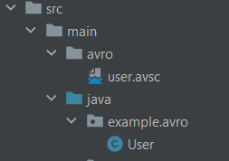
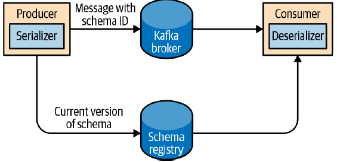

This is part of series of posts about Apache Kafka, with the intention to help me organize the notes and thoughts on 
some interesting parts of Kafka and related topics.

***

We know that to send a record in Apache Kafka, the object in the message has to be serialized.
Kafka has some ready available serializers like `ByteArraySerializer`, `IntegerSerializier`, `StringSerializer` etc.
But what about the case when the type of object is some custom class ?
There are two choices ahead: Either we write a custom serializer class, or we use some library to do that.

### Custom Serializers are not that easy

Let's say that our messages contain a simple object of type Plant, as below:

```java
@AllArgsConstructor
@Getter
public class Plant {
    private int id;
    private String name;
}
```

Now we can write a serializer for the Plant objects:
This class has to implement the **org.apache.kafka.common.serialization.Serializer** interface.
We also should include the size of serialized member objects in the resulting byte array.
Both for the **id** and for the size mentioned above we allocate 4 bytes in the buffer.

```java
import java.nio.ByteBuffer;
import java.util.Map;

public class PlantSerializer implements Serializer<Plant> {

    @Override
    public byte[] serialize(String topic, Plant plant) {
        try {
            byte[] serializedName;
            int stringSize;
            if (plant == null)
                return null;
            else {
                if (plant.getName() != null) {
                    serializedName = plant.getName().getBytes("UTF-8");
                    stringSize = serializedName.length;
                } else {
                    serializedName = new byte[0];
                    stringSize = 0;
                }
            }
            ByteBuffer buffer = ByteBuffer.allocate(4 + 4 + stringSize);
            buffer.putInt(plant.getId());
            buffer.putInt(stringSize);
            buffer.put(serializedName);
            return buffer.array();
        } catch (Exception e) {
            throw new SerializationException("Error when serializing Plant to byte[] " + e);
        }
    }

    @Override
    public void configure(Map configs, boolean isKey) {
    }

    @Override
    public void close() {
    }
}
```

Let's say that later down the road, the **Plant** class changes. New members are added, types of the existing ones
are changed, and so on. Furthermore, different teams use different versions of this class, some of them use the new one,
while
some continue with the old. That's the point where building and maintaining such serializer class becomes too heavy a
burden.

### Serializer/Deserializer libraries

There is a handful of libraries that help with serialization / deserialization.
Such libraries include **Apache Avro**, **Thrift**, and **Protobu**.
Let's take a look at the first one, **Apache Avro**.

### Apache Avro

To serialize an object, Avro needs a schema. The schema itself is a json document, which
describes the data that should be serialized. For each field, its name and its type are declared.
Schemas can be stored in a file with **.avsc** prefix.
An example:

```json
{
  "namespace": "example.avro",
  "type": "record",
  "name": "User",
  "fields": [
    {
      "name": "name",
      "type": "string"
    },
    {
      "name": "favorite_number",
      "type": [
        "int",
        "null"
      ]
    },
    {
      "name": "favorite_color",
      "type": [
        "string",
        "null"
      ]
    }
  ]
}
```

To add Avro in a maven project, the **pom.xml** should contain the dependency and a plugin for code generation.
In this plugin declaration, we include the source directory (the place where we store schemas).

```xml

<dependency>
    <groupId>org.apache.avro</groupId>
    <artifactId>avro</artifactId>
    <version>1.11.1</version>
</dependency>
```

**

```xml

<plugin>
    <groupId>org.apache.avro</groupId>
    <artifactId>avro-maven-plugin</artifactId>
    <version>1.11.1</version>
    <executions>
        <execution>
            <phase>generate-sources</phase>
            <goals>
                <goal>schema</goal>
            </goals>
            <configuration>
                <sourceDirectory>${project.basedir}/src/main/avro/</sourceDirectory>
                <outputDirectory>${project.basedir}/src/main/java/</outputDirectory>
            </configuration>
        </execution>
    </executions>
</plugin>
<plugin>
<groupId>org.apache.maven.plugins</groupId>
<artifactId>maven-compiler-plugin</artifactId>
<configuration>
    <source>1.8</source>
    <target>1.8</target>
</configuration>
</plugin>
```

When compiling the project, the classes will be generated automatically by Avro, based on the previously-defined schema.




If we take a look at the generated class **User.java** we will notice a lot of extra code, ~500 lines, related to
Avro's internal serialization process.
There are two important points to be made:

1. Each serialized object, is required to contain the whole schema within.
2. Apache Avro supports backward and forward compatibility. If we decide to change one or more fields in the schema,
   then there will be no disruption when reading, via a new schema, a message that was serialized with the old one.
   Sure, there are rules for compatibility, as described in Avro documentation.

The point 1) creates a serious drawback in the usage of Avro for serialization in Kafka. Imagine if we send the schema
all over again within each message, it will create quite an overhead in CPU processing during serialization /
deserialization.

### Schema Registry

Schema Registry is a common architecture pattern. There are several open source implementations,
e.g. **Confluent Schema Registry**.

The idea is to store all the schemas used to write data to Kafka in the registry. Then
we simply store the identifier for the schema in the record we produce to Kafka. The
consumers can then use the identifier to pull the record out of the Schema Registry
and deserialize the data.



In the **properties** passed to Kafka Producer, we have to include now also the **schema.registry.url**. 

```java
Properties props=new Properties();
props.put("bootstrap.servers","localhost:9092");
props.put("key.serializer","io.confluent.kafka.serializers.KafkaAvroSerializer");
props.put("value.serializer","io.confluent.kafka.serializers.KafkaAvroSerializer");
props.put("schema.registry.url",schemaUrl);
```


## Sources:

[1] Kafka: The Definitive Guide (2022) by Gwen Shapira et. al.
<br>
[2] [Apache Avro - Getting Started With Java](https://avro.apache.org/docs/1.11.1/getting-started-java/).
