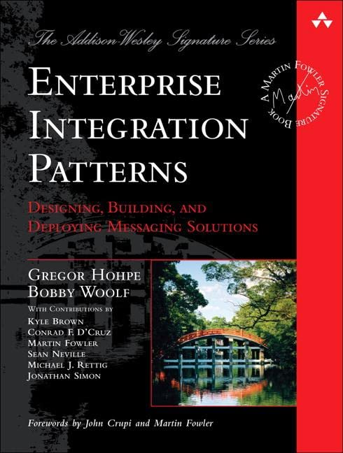
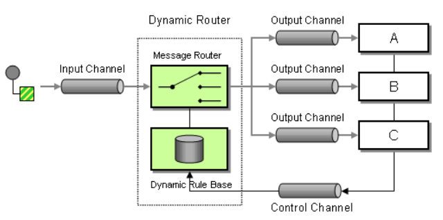
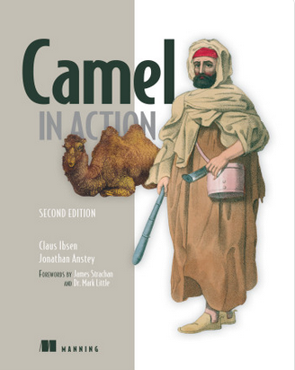
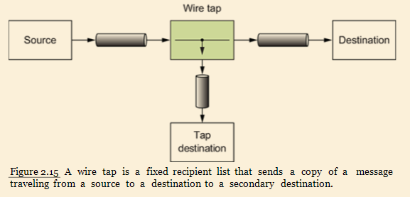
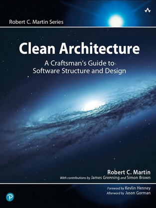
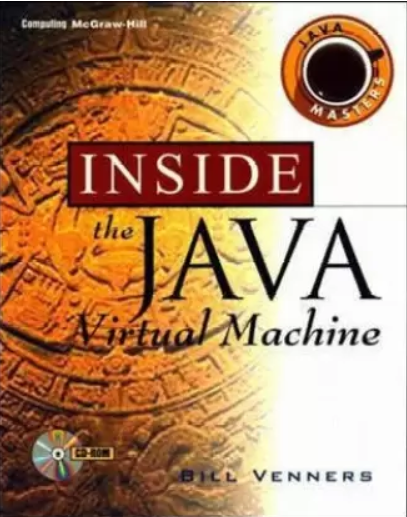
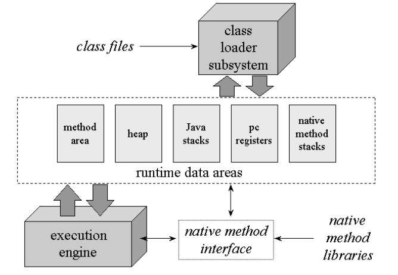
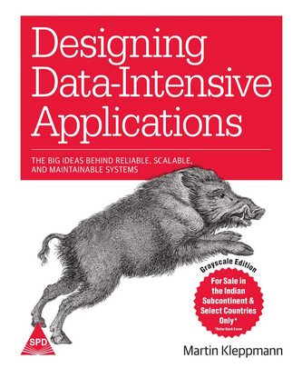

Nowadays, there are many kinds of resources one can make use of to learn and master some topic.
Online courses, videos, tutorials, articles, meetups, podcasts and what not.
And among such a plethora of choices, we tend to overlook the classic one: Books.
As a lifelong avid reader, I have a special relationship with books.

Even in our field, there are some qualities that books do possess that are hard to find in other mediums.
The long and articulate technical prose of books gives you an overview that has both depth and breadth on its subject.
It gives you a philosophical and historical perspective on the topic, which is rare today:

+ What was the context when some technology was born ?
+ What was the need ?
+ What the existing alternatives were missing at the time ?
+ How did it evolve through the years ?
+ How does it stand currently and what the future looks like ?

What are some qualities that make a technical book stand out ?

+ Beautiful drawings, diagrams, illustrations.
+ Easy to read and comprehend statistics ands graphs
+ Interesting, memorable examples, self-contained; that can drive home a point quickly
+ Clear and simple language that is easy to read

#### Some books that I've enjoyed:

### 1. Enterprise Integration Patterns - Gregor Hohpe, Bobby Woolf

{:height="200px" width="150px"}
{:height="200px" width="400px"}

Enterprise Integration started as a discipline in the 80s. The idea is to use messaging to integrate
systems with each other. I think it has known some kind of revival recently due to the distributed programming
and more and more applications that need to communicate and share data with each-other, at some point in time.

Like every good book, the teachings of this one not only have stood the test of time, but also go beyond its strict subject. 
Studying the patterns described in this book give you some insight on what it takes to design systems that facilitate the 
communication among other systems. Not only that, but also how to make such systems resilient, dynamic, etc... .
A classic in the literature for aspiring software architects.

### 2. Camel In Action - Claus Ibsen, Jonathan Anstey
(Second Edition, 2018)

{:height="200px" width="150px"}
{:height="200px" width="400px"}

Well, since I included *EIP* (Enterprise Integration Patterns) above, I have to also add this one about Apache Camel.
It actually goes about implementing a lot of those patterns through Apache Camel.
Actually, it seems there are new books every day about frameworks, libraries and such.
And I've also read other books part of Manning's "In Action" series, but this is probably one of the best written of them.
The technical diagrams are great, the content seems well-organized.
It has a perfect balance between theoretical concepts and implementation examples.
The writing is quite clear and friendly for beginners of Apache Camel.

### 3. Clean Architecture - Robert C. Martin (“Uncle Bob”)

{:height="200px" width="150px"}

Another classic on the list. You can read in length about the origin of SOLID design principles in this book.
The lessons in this book are distilled from a life of experience on the industry of Uncle Bob.
I know that the advices of Robert C. Martin have generated a lot of controversy, but I believe that's because people 
treat it as a dogma rather than as a collection of subjective perspectives on software structure and design.
From my point of view, there is really much to learn from his books.

Of all the advices present in this book, one has stuck in my memory through the years.
Everytime that I doubt the need for abstract patterns and structures, I always think about this lesson:

There is one story about how in the 60s they used to bind the code directly to the IO devices.
If they needed to read cards from the card reader, they used code that talked directly
to the card reader. If they needed to punch cards, they wrote code that directly manipulated the punch.
Then magnetic tape was invented. It was much more secure, faster to read and write and very easy to make
backup copies. But now those programs had to be rewritten to use magnetic tape. That was a big
job. So they invented device independence. The operating systems of the day abstracted the IO devices into
software functions that handled unit records that looked like cards. The programs
would invoke operating system services that dealt with abstract unit-record devices.

### 4. Inside the Java Virtual Machine - Bill Venners

{:height="200px" width="150px"}
{:height="200px" width="300px"}

I've read this book years ago, and I feel the need to re-read it. Maybe not the most enjoyable but I don't know any better book
about JVM. It goes on a long technical journey, very accurate description of how the JVM is built and all the details. Sometimes
it gets a bit repetitive, but it's good nonetheless.
There are many languages that target JVM like Java, Kotlin, Scala, Clojure, Groovy etc.
And the power of JVM stands in its abstraction. You can create a language that targets JVM and while doing so you have a free
hand to implement things however you like, while still having constraints imposed by JVM that make it inherently more secure, 
portable, fast etc. 
Yes, I haven't had the chance to work on such low level details, but it's quite important and fascinating to learn the internals
of the technology you use daily.

### 5. Designing Data Intensive Applications - Martin Kleppmann (2017)

{:height="200px" width="150px"}

+ Part I   - Reliable and Scalable Applications; Data Models, Storage, Retrieval, Encoding
+ Part II  - Replication, Partitioning, Transactions, Consistency & Consensus, The Trouble with the Distributed Systems.
+ Part III - Batch, Stream Processing, The Future of Data Systems.

Published less than six years ago, it soon established itself as a modern classic reading for everyone interested in distributed systems.
And for good reason. It has an absolutely excellent structure and good organization of content. There is a good balance between technical rigour and
readability on discussion of each topic. The author makes a great summary of the latest developments of the field. 
Now, do I remember correctly the levels of transaction isolation, years after reading this book ? Definitely not! 
Am I aware of the complexities that involve ordering of events and synchronization in distributed systems ? 
Yes, and that's what's expected from a good book.

### Some other books I'd like to mention:

* Design Patterns - (GOF)
* Clean Code - Robert C. Martin
* A Philosophy of Software Design - J. Ousterhout
* Domain Driven Design - Eric Evans

