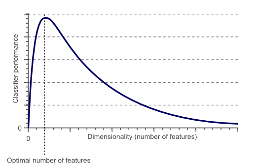
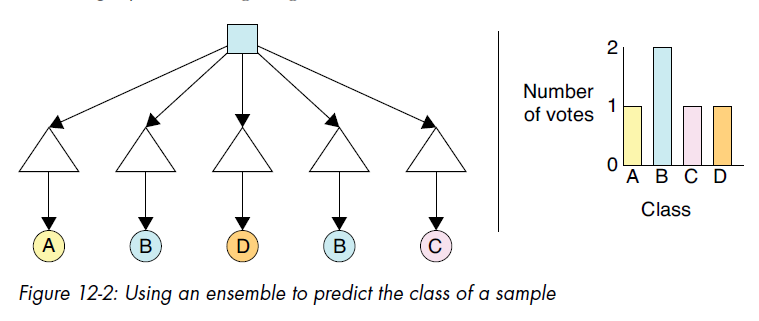

Last month, I decided to dip my toes into the world of machine learning.
It's not a present goal for me to switch to an ML engineering role, and I also believe there is a lot
of hype going around regarding generative AI etc.
Still I think it's very important to have an understanding (however superficial) of such a powerful 
area of Computer Science.

## A quick summary of things I learned on the way

I started with a quick primer on Probability and Statistics covering distributions, covariance, correlation etc.
**Will Kurt (2019) - Bayesian Statistics the Fun way** was a pleasant reading as an intro to the Bayesian world.

Then I read on some Information Theory topics. I recall a one-semester course we had during university, were 
we covered Shannon, encodings and such, but more from a circuits point of view as far as I remember.
So the concepts of **rare events**, **entropy**, divergence, **information gain** were new to me and quite interesting.

**Vectors**:
Embeddings, a nice way to represent data that contains many dimensions (features).
There are equations to measure the similarity among vectors.
A lot of databases specialized on vector storage and retrieval have sprung up.

**Fundamentals**
Classification process, clustering, Boundary methods, Course of Dimensionality, etc.

{:height="339px" width="521px"}

**Overfitting**: 
You focus too much on the details during training and fail to see the big picture on real data.

**Underfitting**: 
You try hard to see the big picture, to make generalizations, but you miss a lot of details on real world data.

**How to shrink a dataset**: 
Remove redundant, irrelevant features
Combine features (Dimensionality Reduction)
We can use PCA (Principal Component Analysis), a mathematical technique for that purpose

**Data augmentation**:
Let's say our training dataset is quite small, that's all the data we could get our hands to.
There are data augmentation techniques to artificially expand both the size and diversity of a dataset.
Geometric transformations, noise injection, mixing data, and alike.

**Ensembles**:
We train multiple classifiers (e.g. Decision Trees) from different bootstrap of the same training set.
When training is done, and we’re evaluating a new sample, we give it to
all the decision trees in the ensemble. Each tree produces one class prediction.
We treat the predicted classes as votes in a plurality election, producing
either a winner or a tie.

{:height="321px" width="759px"}

It is amazing that there are already implementations, functions and libraries for a plethora of machine-learning techniques.
I just discovered a [full-blown machine-learning library in Java, named Weka](https://waikato.github.io/weka-wiki/).
Weka not only has an API but also a GUI tool that allows you to load datasets, run ML-algorithms etc.
It's excellent especially for beginners because it lets them focus on learning the process instead of mathematical details.

Here you have also some [datasets from Weka](Sample Weka Data Sets) to play around with.

## What I plan to do next ?

I will continue quickly with some Deep Learning topics such as Neural Networks etc.
Afterward I plan to start with Large Language Models. I already have some small ideas
to play around with, and I'm quite interested.

## Sources:

[1] Andrew Glassner (2021) - Deep Learning A Visual Approach
 
[2] Kevin P. Murphy (2022) - Probabilistic Machine Learning
