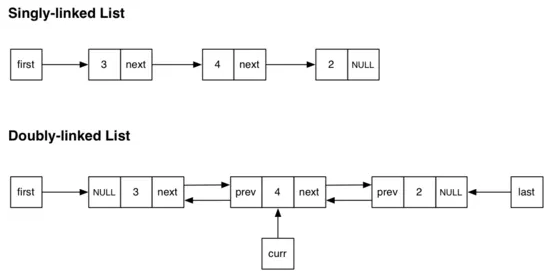
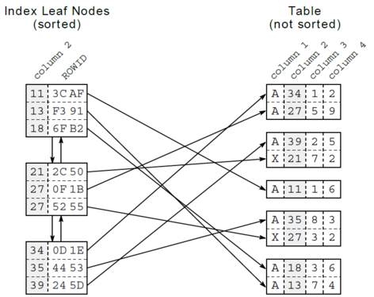
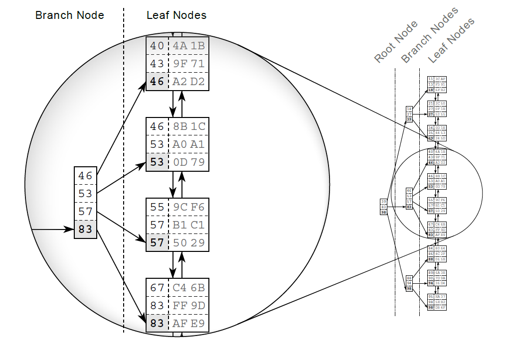
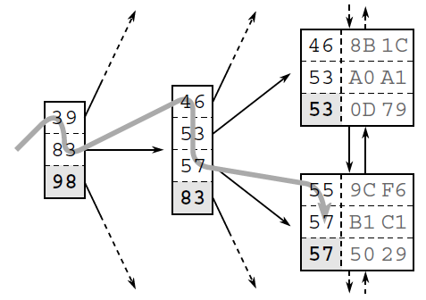
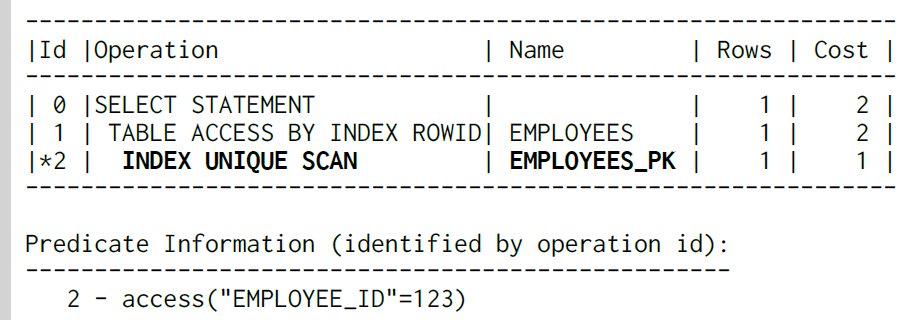
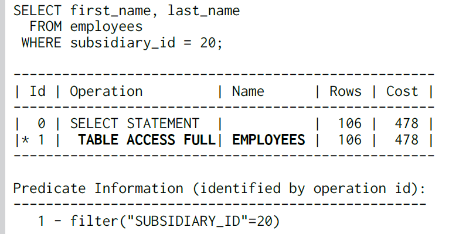
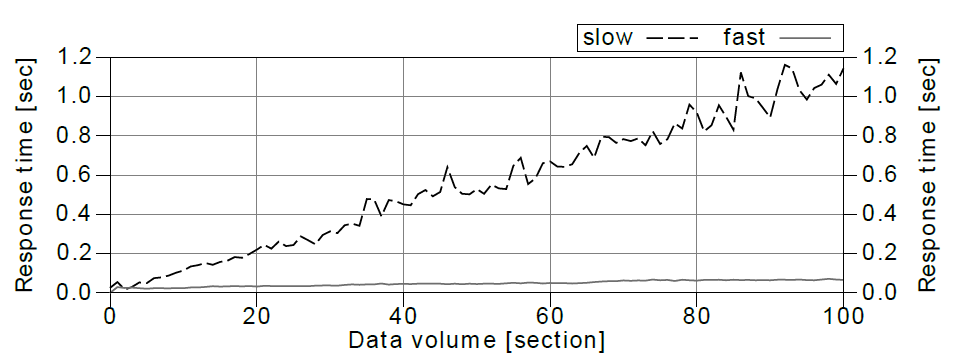

A LinkedIn connection recommended the book [SQL Performance Explained by Markus Winand](https://www.amazon.com/Performance-Explained-Everything-Developers-about/dp/3950307826).
After reading it, I can wholeheartedly endorse it too. The book's clear and concise language is a refreshing change
from the often bloated technical publications out there.

The whole book, front to back, stresses the absolute importance that indexing has on the performance of SQL queries.
The first chapter, "An anatomy of Index" was the most interesting one for me. I totally had no clue about the underlining
structure of a database's index, and it turns out that understanding it is the key to good indexing.


* [Some notes and important ideas from the book](#intro)
* [Logical representation separate from the physical layer](#representation-layers)
* [Index entries are stored in blocks](#index-entries-are-stored-in-blocks)
* [The Search Tree (B-Tree)](#the-search-tree)
* [Not all indexing operations are fast, some might cause performance bottleneck](#not-all-indexing-operations-are-fast-some-might-cause-performance-bottleneck)
* [Databases help you understand what some particular index is doing](#databases-help-you-understand-what-some-particular-index-is-doing)
* [An example of a problematic index ](#an-example-of-a-problematic-index)
* [Same query, different indexes, different scaling impact](#same-query-different-indexes-different-scaling-impact)
* [Remarks](#remarks)


<!-- TOC --><a name="intro"></a>
## Some notes and important ideas from the book
---

The following statement creates an index over a table. This is a distinct data structure, it occupies its own **disk space** and
contains a duplicate of the table's data. The index section at the back of a phone-book it is the classic analogy:
a bit **redundant**, but helps you quickly find the information stored in the main content.

```sql
CREATE INDEX index_name
ON table_name (column_name [ASC | DESC]);
```

But wait, there is a big difference: Contrary to the printed index, the database must keep the index updated on every
change (insert, update, delete). Understandably, no large amounts of data should be moved, so this constraint is at the heart
of the index's data structure: a combination of a **doubly linked list** and a **search tree**.

<!-- TOC --><a name="representation-layers"></a>
## Logical representation separate from the physical layer
---



Index stores an ordered presentation of the data, which makes searching through it much easier.
As we wrote above, we need to avoid moving large data when updating the index.
The solution is to have a logical representation separate from the physical one.

The logical order is established via a [doubly linked list](https://en.wikipedia.org/wiki/Doubly_linked_list).
The insert / delete / update operations in linked lists are faster since there is no need to move data
around, just update the links. Also, the fact that it is double linked, makes it easier to search
through it in *forwards* or *backwards* as it is needed.

<!-- TOC --><a name="index-entries-are-stored-in-blocks"></a>
## Index entries are stored in blocks
---

We mentioned that index occupies its own space in the database.
And yes it's true, index is stored in the database blocks (pages), which is the smallest storage unit in a database.
(Notice that, unlike the index, the table data is stored in a heap structure and is not sorted at all).

- These database blocks where index is stored, are also known as **index leaf nodes**.
- All index blocks are of the same size — typically a few kilobytes.
- Each block contains as much index entries as it's physically possible.
- That means that the index order is maintained on two different levels: the index entries
  within each leaf node, and the leaf nodes among each other using a doubly linked list.


{:height="374px" width="472px"}

Illustration above shows the index leaf nodes and their connection to the table data.
Each index entry consists of the indexed columns (the key, column 2) and refers to the corresponding table
row via its ROWID. There is neither a relationship between the rows stored in the same table
block nor is there any connection between the blocks.

<!-- TOC --><a name="the-search-tree"></a>
## The Search Tree (B-Tree)
---

Yes, we've indexed our table to make searching easier, but with large amounts of data, even the index itself can become
slow to search through. A B-tree can be thought of as a tool that helps us "index the index." By organizing the index in
a balanced and efficient manner, B-trees ensure that search operations remain fast, even as the amount of data grows.
This way, the index remains quick and efficient, just like the original purpose of indexing the table.

B-Tree is a self-balancing tree, whose superpower is a **logarithmic time** for searching, insertion, deletion.
Interestingly, faster indexing was also their [original purpose](https://en.wikipedia.org/wiki/B-tree):

> B-trees were invented by Rudolf Bayer and Edward M. McCreight while working at Boeing Research Labs, for the purpose of
> efficiently managing index pages for large random-access files. The basic assumption was that indices would be so voluminous
> that only small chunks of the tree could fit in main memory. [...] Bayer and McCreight never explained what, if anything,
> the B stands for; Boeing, balanced, between, broad, bushy, and Bayer have been suggested.
> McCreight has said that "the more you think about what the B in B-trees means, the better you understand B-trees".

{:height="446px" width="634px"}


> The tree traversal is a very efficient operation — so efficient that I refer to it
> as the first power of indexing. It works almost instantly — even on a huge data
> set. That is primarily because of the tree balance, which allows accessing
> all elements with the same number of steps, and secondly because of the
> logarithmic growth of the tree depth. That means that the tree depth grows
> very slowly compared to the number of leaf nodes. Real world indexes with
> millions of records have a tree depth of four or five.

{:height="336px" width="477px"}


<!-- TOC --><a name="not-all-indexing-operations-are-fast-some-might-cause-performance-bottleneck"></a>
## Not all indexing operations are fast, some might cause performance bottleneck
---

> Despite the efficiency of the tree traversal, there are still cases where an index lookup doesn’t work as fast
> as expected.

> An index lookup requires three steps:
>   (1) the tree traversal;
>   (2) following the leaf node chain;
>   (3) fetching the table data.
> The tree traversal is the only step that has an upper bound for the number of accessed blocks — the index
> depth. The other two steps might need to access many blocks — they cause a slow index lookup.


<!-- TOC --><a name="databases-help-you-understand-what-some-particular-index-is-doing"></a>
## Databases help you understand what some particular index is doing
---
The Oracle database is rather verbose in this respect and has three distinct
operations that describe a basic index lookup:

- INDEX UNIQUE SCAN performs the tree traversal only. The Oracle
  database uses this operation if a unique constraint ensures that the
  search criteria will match no more than one entry.

- INDEX RANGE SCAN performs the tree traversal and follows the leaf
  node chain to find all matching entries. This is the fallback operation
  if multiple entries could possibly match the search criteria.

- TABLE ACCESS BY INDEX ROWID operation retrieves the row from
  the table. This operation is (often) performed for every matched record
  from a preceding index scan operation.

The important point is that an **INDEX RANGE SCAN** can potentially read a large
part of an index. If there is one more table access for each row, the query
can become slow even when using an index.

<!-- TOC --><a name="an-example-of-a-problematic-index"></a>
## An example of a problematic index
---
The database automatically creates an index for the **primary key**, even though there is no create index statement.
If the Primary Key contains multiple columns, database creates an index on all primary key columns.
This is called a **concatenated index**.

E.g. we have a table with a primary key that entails two fields (employee_id, subsidiary_id);
The employee_id is unique while the subsidiary_id is not.

The index will have this structure:

```sql
CREATE UNIQUE INDEX employee_pk
ON employees (employee_id, subsidiary_id);
```

As long as we are searching by employee_id first, the query will be efficient.
Whenever a query uses the complete primary key, the database can use
an INDEX UNIQUE SCAN — no matter how many columns the index has.
The *execution plan* prepared by database confirms it:

{:height="186px" width="523px"}

But what happens when we want to search by **subsidiary_id** only ?

{:height="186px" width="523px"}

The execution plan reveals that the database does not use the index. Instead
it performs a FULL TABLE SCAN. As a result the database reads the entire table
and evaluates every row against the where clause. The execution time grows
with the table size: if the table grows tenfold, the FULL TABLE SCAN takes ten
times as long. The danger of this operation is that it is often fast enough
in a small development environment, but it causes serious performance
problems in production.

It's interesting that FULL TABLE SCAN (or TABLE ACCESS FULL) operation can be very fast,
depending on the context. E.g. when reading large amounts of data, it is quite fast, the database
can read larger chunks at a time (multi block read). Although the database reads more data, it might need to
execute fewer read operations.

### Moral of the story: Can't use singled-out columns from concatenated index

The database cannot use an index arbitrarily on individual columns of a concatenated index,
which is a B-tree index sorting data by multiple columns. The first column is the primary
sort criterion, and subsequent columns are used for sorting only when the preceding columns
have identical values.

This is similar to a telephone directory sorted first by surname and then by first name.
Thus, a two-column index does not support searching by the second column alone, just as
you can't search a telephone directory by first name.

<!-- TOC --><a name="same-query-different-indexes-different-scaling-impact"></a>
## Same query, different indexes, different scaling impact
---
Let's compare the effect of indexing under increasing data volume:

```sql
SELECT count(*)
FROM scale_data
WHERE section = ?
AND id2 = ?
```

```sql 
CREATE INDEX scale_slow ON scale_data (section, id1, id2); 
```

```sql 
CREATE INDEX scale_fast ON scale_data (section, id2, id1); 
```
If you can notice, the only difference between those two indexes, is the **column ordering**.
And it turns out that ordering is quite important. As a rule, the query must always filter
on the leading columns in the order they appear in the index.

{:height="250px" width="669px"}

The chart shows a growing response time for both indexes. On the right
hand side of the chart, when the data volume is a hundred times as high,
the faster query needs more than twice as long as it originally did while
the response time of the slower query increased by a factor of 20 to more
than one second.


<!-- TOC --><a name="remarks"></a>
## Remarks
---
This was a simplified summary of the "first principles" of indexing discussed in this book.
The other chapters offer insights and techniques on how to take indexing seriously when attempting
to optimize queries. After all, it turns out that it's not a piece of cake: it requires experience,
and intuition alongside the theoretical knowledge. 


