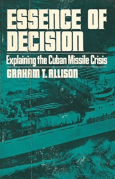

> Do I contradict myself?  
> Very well then I contradict myself,  
> (I am large, I contain multitudes.)  
> *W. Whitman* 

* [Humans are complex](#humans)
* [Decisions should not be taken lightly either](#decisions)
* [A Systems thinking](#systems)
* [Final thoughts](#final)

<!-- TOC -->
### Humans are complex

I recall my years at university when my viewpoints were quite rigid. My way of discussion was passionate, emotional,  
convinced of my own certainty and filled with self-assurance. I would reference what I had read—Plato, Sartre, Russell, 
Freud, Marcuse, and others—regardless of whether I really understood them. I even felt it was acceptable to make 
up sayings of them, if such sayings supported my ideas. I was intent on outsmarting others, and my ego could not accept 
any form of defeat. During debates, I was so deeply attached to the thesis I was defending that I felt as though I had 
embodied it.

But years flow, and life humbles you. You've known your defeats now, you've met plenty of smarter people in 
your field and outside it. You know that there are hundreds of ways to success, and you can't compare people in a 
scalar mode anymore, people are vectors, full of hundreds of dimensions, qualities, all unique to them, and all coming 
in wide ranges.

You grow continuously and begin to develop a sense of critical thinking. You make an effort to read critiques of the 
books you hold dear, regardless of how cherished they are. There are no certainties, only probabilities and nuances. 
In fact, you avoid certainties as if they were a plague, knowing how often they can be misleading. Instead, you learn 
to love the doubt itself. You scrutinize your political beliefs and question the way history has been told to you.

Now, you no longer debate to win. Instead, you genuinely strive to understand how your friend perceives the world 
and why your values differ. Is it due to different social backgrounds, upbringing ? Distinct life experiences that have 
shaped your neurons differently? Perhaps your readings and philosophical approaches to life are also different—while 
you may have embraced utilitarianism, they swear by Kant’s ethical theory. Maybe you’ve experienced suffering in 
different ways. Maybe what you consider insignificant, to them is, oh, the most dear thing.

<!-- TOC -->
### Decisions are not to be taken lightly, too
---

{:height="295px" width="190px"}

One of my first encounters of a *systems based* approach, was a book originally published on 1971, and later revised 
with more recent info on 1999, by **Graham T. Allison**, *Essence of Decision: Explaining the Cuban Missile Crisis*

The title is based on a speech by *John F. Kennedy*, in which he said:
> The essence of ultimate decision remains impenetrable to the observer - often, indeed, to the decider himself.

The book analyzes the 1962 Cuban Missile Crisis. Allison used the crisis as a case study into governmental 
decision-making. The book became the founding study of the *John F. Kennedy School of Government*, and in doing so 
revolutionized the field of international relations. [See wiki](https://en.wikipedia.org/wiki/Essence_of_Decision)

In the beginning of each section, Allison poses the following three questions:

1. Why did the Soviet Union decide to place offensive missiles in Cuba?
2. Why did the United States respond to the missile deployment with a blockade?
3. Why did the Soviet Union withdraw the missiles?

At the time the book was written, the common belief was that governments or states act rationally. They have a set of 
goals based on their national interests and ideological orientation. When the situation arises, that a decision needs 
to be made, the government rationally analysis all the information at hand and chooses the best course of action that 
maximizes its goals. This model of thinking was known as the *Rational Actor Model*.

To Allison, this model fails to capture the full complexity of decision-making in case of an organisation, whether it's 
a government, an institution or a corporate. The model treats the organisation as an opaque, unified entity, not taking 
into account that the entity itself is like a living organism, large and complex, with numerous components, interacting 
and diverging among each-other, which, after all, are made up of humans; each of them, influenced by rational and 
irrational factors. And in the end, each decision is in fact the resultant of all the interaction between these 
components.

>> Governmental behavior can therefore be understood, according to a second conceptual model, less as deliberate
>> choices and more as outputs of large organizations functioning according to standard patterns of behavior.

Allison argues that the old model also fails to account for the imperfect flow of information at any given moment, 
which influences the entire decision-making process. During the crisis, both the Soviets and Americans had to connect 
the dots based on their perceptions, often when information was missing or incomplete.

> Not all this information, however, was on the estimator’s desks. Information does not pass from the tentacle to the 
> top of the organization instantaneously. Facts can be in the system without being available to the head of the 
> organization. Information must be winnowed at every step up the organizational hierarchy, since the number of minutes 
> in each day limits the number of bits of information each individual can absorb.

Allison, instead, focuses on the processes, routines, behaviours, bureaucracy:

> Historians sifting through the rubble might find the cause of the conflagration in the clash of
> national interests and large purposes. Yet the events outlined above, which arise principally from the 
> programs and routines of the large organizations that constitute governments, typically get short shrift in accounts 
> of important events. In contrast, this chapter attempts to focus on the organizationally-determined features of the 
> missile crisis that provided the drumbeat to which the actors marched.

***

A valuable read, offering insightful lessons on the complexity of decision-making. It also provides an enjoyable 
narration of the events surrounding the Cuban Missile Crisis.

<!-- TOC -->
### A systems thinking
---

An essential reading to introduce yourself to the field of Systems Theory, is the famous *Thinking In Systems* by
Donella H. Meadows [2008]. The author, Meadows, was a renown environmental scientist, teacher, writer. The book gives 
a formal, yet easy to understand, description of systems; According to Meadows, systems, no matter if exhibited in 
nature, organizations, or society, share a number of characteristics among them.

First, the idea of **stocks** and **flows**. Stocks are elements of the system that you can see, feel, count, or 
measure them at any given time. Flows are changes that happen to the system. Recall the money in a bank account, 
the deposits and withdrawals are a good example of such a system.

Second, each system needs a **feedback loop**, which is critical in controlling the behaviour of a system.

Third, **leverage points**. Not all points are created equal :) , in the sense that there are strategic points 
within a system, where a small change can lead to significant impacts. It reminds me the *Pareto principle*.
I see it as a thing that people regularly fail at. How many public projects, government initiatives
waste energy and resources due to focusing on points in a system where the leverage is pretty small.

Fourth, **Resilience**, **Self-organization** and **Hierarchy**. All systems seem to display some degree of these 
characteristics.

Fifth, **Mental Models**: The way we perceive systems and the world around us is influenced by our mental models. 
Changing these models is often necessary to understand and improve systems effectively. This is an old theme of 
philosophy dating back to the *Aristotle's Categories* and even earlier, continuing through the modern epistemology. 
This is another often neglected aspect on our systems' analysis. We shouldn't forget to question, verify, and ensure 
that our mental models, our perceptions are correct at least to the extent that they can be verified.

<!-- TOC -->
### Final thoughts
---

{:height="376px" width="563px"}

Systems Theory, to me, serves as a reminder in today's world to return to *first principles*, to embrace a dialectical 
approach, and to revive the old peripatetic way of understanding nature and society. I find an even stronger resonance 
with Eastern philosophies like Buddhism and Taoism, particularly with the concept of all things in the universe being 
interconnected.

Of course, it isn't easy for the human brain to grasp and process the extreme complexity of the real world. And that's 
why we rely on simple models; that's where the heuristics and unfortunately, even prejudices come in to play. 
Nonetheless, we should strive now and then, towards the full picture, towards a **holistic perspective**.
I believe that such perspective is equally powerful both in seeking harmony in life and in analyzing and understanding 
complex systems.

#### Some other reading suggestions:
---
+ The Righteous Mind: Why Good People are Divided by Politics and Religion [2012]
+ The Toyota Way - Jeffrey K. Liker [2020]